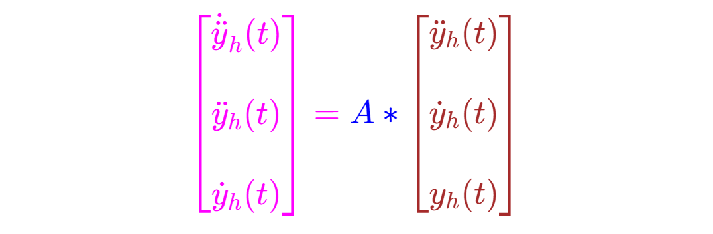
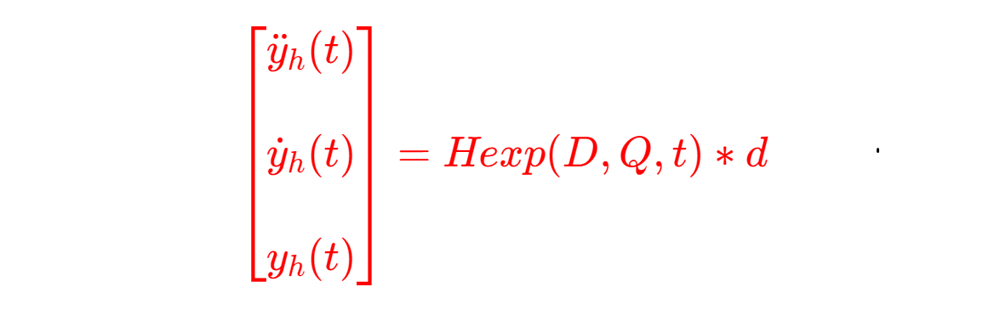
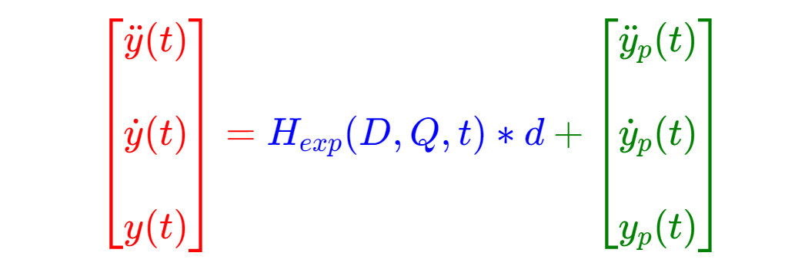
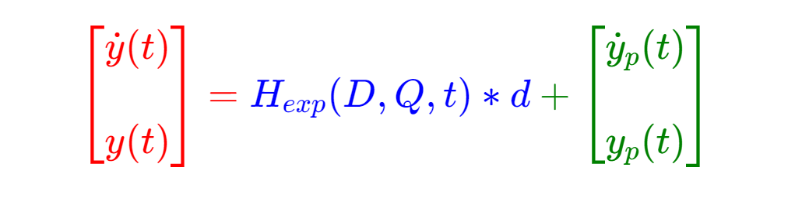
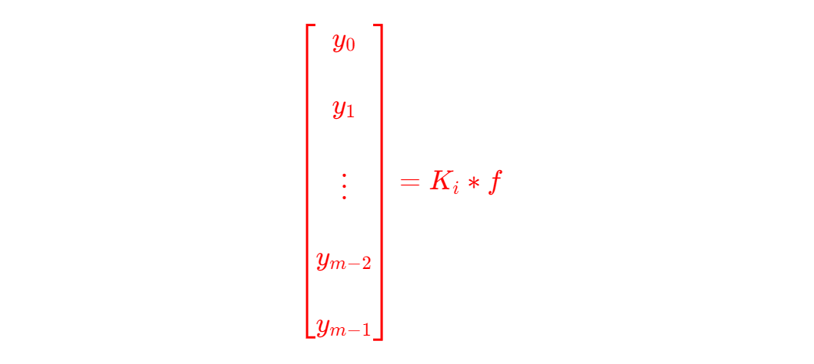

<!--     範例 App_49 儲存庫      -->

### 
<!--                 
# \[{  \color{Fuchsia}精\;銳\; \color{Purple}矩\;陣\;  \color{Red}計\;算\; \color{Green} 求\;解\;器  }\] 
-->  
 

<!--         
#### \[{  \color{Fuchsia} 【 \color{Green}  Sharp \; Matrix \; Solver \;  \color{Brown} \iff  \;  \color{Red} S\;M\;S】 }\]  
-->  
  

---
 
## \[{ \color{Fuchsia} Time-Frequency-Signal \;(Response) \quad Solution  }\] 
 
<!--     ##### \[ using \]   -->
<!--         --> 
#####  $$using$$     

<!--   
## \[  \color{Red} Precisely \; Numerical \; Value \; Computations  \]  
-->  
 

  
<!--     ##### \[ with \]   -->   
<!--      -->  
#####  $$with$$   

<!--   
## \[{ \color{Green} Real \; \color{Red} And \; \color{magenta} Complex \quad \; \color{Brown} Matrix \;\; Transform  }\] 
-->
  

  
<!--         ##### \[ Part \; 5 \]    -->   
<!--          -->  
#####    $$part \quad 4$$  

####

---  

# $時\quad頻\quad數\quad值\quad計\quad算$   

### $$Precisely \quad Time-Frequency \quad Numerical \quad Computations$$  

---  

# $三\quad階\quad微\quad分\quad方\quad程\quad式 ：$  

### $$N(t) \ast \dot{\ddot{y}}(t) + M(t) \ast \ddot{y}(t) + C(t) \ast \dot{y}(t) + K(t) \ast y(t) = f(t)$$  

### $$由齊次解得到 \quad \dot{\ddot{y}}_h(t)、\ddot{y}_h(t)、\dot{y}_h(t)、y_h(t)$$    

### $$由特別解得到 \quad \dot{\ddot{y}}_p(t)、\ddot{y}_p(t)、\dot{y}_p(t)、y_p(t)$$    

## 
$$
\begin{bmatrix}
\dot{\ddot{y}}_h(t) \\\\  
\ddot{y}_h(t) \\\\ 
\dot{y}_h(t)  
\end{bmatrix} = 
\begin{bmatrix}
-1.0 \ast N_i(t) \ast M(t) & -1.0 \ast N_i(t) \ast C(t) & -1.0 \ast N_i(t) \ast K(t) \\\\ 
I                 &    O    &    O     \\\\ 
O                 &    I    &    O      
\end{bmatrix}  \ast 
\begin{bmatrix} 
\ddot{y}_h(t)  \\\\ 
\dot{y}_h(t)  \\\\ 
y_h(t)  
\end{bmatrix}
$$

###  
<!--   
## \[{ \color{Fuchsia} \begin{bmatrix} \dot{\ddot{y}}_h(t) \\\\ \ddot{y}_h(t) \\\\ \dot{y}_h(t) \end{bmatrix} = \color{Blue} A \ast \color{Brown} \begin{bmatrix} \ddot{y}_h(t) \\\\ \dot{y}_h(t) \\\\ y_h(t) \end{bmatrix} }\]   --> 
   

$$ 即 \quad A = 
\begin{bmatrix}
-1.0 \ast N_i(t) \ast M(t) & -1.0 \ast N_i(t) \ast C(t) & -1.0 \ast N_i(t) \ast K(t) \\\\ 
I                 &    O    &    O     \\\\ 
O                 &    I    &    O      
\end{bmatrix}  
$$

##  

###  $$A(t) \times Q(t) = Q(t) \times D(t) \quad  => \quad A(t) = Q(t) \times D(t) \times Q_i(t)$$  

###  

<!--      
## \[{ \color{Red} \begin{bmatrix} \ddot{y}_h(t)  \\\\ \dot{y}_h(t) \\\\ y_h(t) \end{bmatrix} = Hexp(D, Q, t) \ast d }\] 
--> 
  

###  

### $$A是實數系統矩陣，D是複數對角線特徵值矩陣。$$  

### $$Q是複數特徵向量矩陣，Qi是Q的逆矩陣。$$  

### $$Hexp(D, Q, t) 為複數轉換矩陣。$$

### $$d 為複數係數向量，由初始值或是邊界值而定。$$  

####    

## $$訊\quad號\quad響\quad應\quad值【振\quad幅】如\quad下 ：$$  

<!--    
## \[{ \color{Red} \begin{bmatrix} \ddot{y}(t) \\\\ \dot{y}(t) \\\\ y(t) \end{bmatrix} = \color{Blue} H_{exp}(D, Q, t) \ast d \color{Green} + \begin{bmatrix} \ddot{y}_p(t) \\\\ \dot{y}_p(t) \\\\  y_p(t) \end{bmatrix} }\]
-->  
  

##  

---  

##

#  $二\quad階\quad微\quad分\quad方\quad程\quad式 :$

### $$M(t) \ast \ddot{y}(t) + C(t) \ast \dot{y}(t) + K(t) \ast y(t) = f(t)$$  

## $$訊\quad號\quad響\quad應\quad值【振\quad幅】如\quad下 ：$$  

<!--      
## \[{ \color{Red} \begin{bmatrix} \dot{y}(t) \\\\ y(t) \end{bmatrix} = \color{Blue} H_{exp}(D, Q, t) \ast d \color{Green} + \begin{bmatrix} \dot{y}_p(t) \\\\  y_p(t) \end{bmatrix} }\]
-->   
  

##

---  

##

# $一\quad階\quad微\quad分\quad方\quad程\quad式：$

### $$C(t) \ast \dot{y}(t) + K(t) \ast y(t) = f(t)$$

## $$訊\quad號\quad響\quad應\quad值【振\quad幅】如\quad下 ：$$  

<!--      
## \[{ \color{Red} \begin{bmatrix} y(t) \end{bmatrix} = \color{Blue} H_{exp}(D, Q, t) \ast d \color{Green} + \begin{bmatrix} y_p(t) \end{bmatrix} }\]
-->  
  

##  

---  

# $零\quad階\quad微\quad分\quad方\quad程\quad式：$

### $$K \ast y = f$$  

## $$固\quad定\quad訊\quad號\quad響\quad應\quad值\quad如\quad下 ：$$

<!--      
#### \[{ \color{Red} \begin{bmatrix} y_0 \\\\ y_1 \\\\  \vdots \\\\ y_{m-2}  \\\\ y_{m-1} \end{bmatrix} = K_i \ast f }\]
-->  
  

##

---  

<!--  
## $$由齊次微分方程式，得到\quad \ddot{y}_h(t)、\dot{y}_h(t)、y_h(t)$$  

### $$M(t) \times \ddot{y}_p(t) + C(t) \times \dot{y}_p(t) + K(t) \times y_p(t) = f(t)$$  

## $$由非齊次微分方程式，得到\quad \ddot{y}_p(t)、\dot{y}_p(t)、y_p(t)$$   

# $通\qquad解 ：$ 

## 
$$
\begin{bmatrix}
\dot{y}(t) \\\\ y(t)
\end{bmatrix} =
\begin{bmatrix}
\dot{y}_h(t) \\\\ y_h(t)
\end{bmatrix} + 
\begin{bmatrix}
\dot{y}_p(t) \\\\ y_p(t)
\end{bmatrix}
$$ 
-->

>  **r階微分方程式，其空間維度上有m個自由度，齊次微分方程式：N(t) * y'''(t) + M(t) * y''(t) + C(t) * y'(t) + K(t) * y(t) = f(t)，使用友矩陣(Companion Matrix)的方法，求得系統或狀態矩陣 A(t)，再求得 A(t) * Q(t) = Q(t) * D(t)，D（t）是特徵值矩陣，Q（t）是特徵向量矩陣，本求解法(Forward Problems)可對應於 Laplace、 Fourier、 Z Transform 或是捲積積分法(Inverse Problems)等等。隨時間變化的角頻率（w）是系統矩陣 A（t）之複數特徵值的虛數值，隨時間變化的模態，是系統矩陣 A（t）的特徵向量。D（t）和Q（t）為系統的潛在特性，並在系統受到外力時，才會顯現出來。若要求得系統的訊號響應值[Signal Response]，應由實際量測的初始值或是邊界值，求得複數係數向量d，再依據如下推導的公式求得。有關初始值和邊界值分別參見App_6J和App_6M儲存庫，而相關的推導公式和所顯示的數學矩陣方程式，如以上所示的矩陣表示式，其中D為複數特徵值矩陣，Q為複數特徵向量矩陣（模態），Q i為Q之逆矩陣，Hexp(D, Q, t)和d分別爲複數轉換矩陣和複數向量。**   

## 

<!-- 
$$
\begin{bmatrix}
\dot{y}_h(t) \\\\ y_h(t)
\end{bmatrix} =  Hexp(D, Q, t) \times d_h
$$
-->

#  $實 \quad 例 \quad 計 \quad 算 \quad :$

### $$詳細的【CSharp】程式碼和輸出圖表，請參考本儲存庫中的檔案$$ 

##

$$N(t) = 
\begin{bmatrix} 
-2.7 \ast t^2 \ast sin(1.3 \ast t) & -5.5 & 0 & 5.5 \\\\ 
3.5 & -8.5 & -9.8 \ast t^2 & -4.8 \\\\ 
6.7 & 27.9 & 8.5 & -20.5 \ast t^2 \ast cos(1.9 \ast t) \\\\ 
-1.5 \ast t \ast cos(1.9 \ast t) & 4.8 & 0 & 1.5 \ast t^3 
\end{bmatrix}  
$$  

###

$$M(t) = 
\begin{bmatrix}
19 & -1.5 & -2+13.3 \ast sin(0.85 \ast t) & 1.1 \\\\ 
-1 & 15 & 0 & 1.3 \\\\ 
-10-2.7 \ast cos(1.3 \ast t) & -3 & 27  & 4.5  \\\\  
5.5 & 2.7 & -2.3 \ast t & -3.5 \ast t^2 
\end{bmatrix}
$$  
 
###

$$C(t) = 
\begin{bmatrix}
35 & -1-13.2 \ast sin(0.35 \ast t) & -0.5 & 2.5 \\\\ 
-1.5 & 40 & -1.5 & 0 \\\\ 
-1.2+22.5 \ast cos(1.95 \ast t) & -1.5 & 75 & 0 \\\\  
-27.5 & 18.3 & 9.5 & -50.9 \ast t \ast sin(2.5 \ast t)  
\end{bmatrix}
$$  

$$K(t) = 
\begin{bmatrix}
60 & -8 & -2-332 \ast sin(1.37 \ast t) & -2.7 \\\\ 
-16 & 180 & -120 & 100 \\\\ 
-20 & -100+579 \ast cos(0.24 \ast t) & 300 & 20 \\\\ 
1.5 \ast sin(t) & -9.8 & 150 & 11.5 \ast t^2 \ast cos(t)  
\end{bmatrix} 
$$  

###  

#    

$$A(t) = 
\begin{bmatrix} 
-1.0 \ast N_i(t) \ast M(t) & -1.0 \ast N_i(t) \ast C(t) & -1.0 \ast N_i \ast K(t) \\\\ I & O & O \\\\ O & I & O  
\end{bmatrix}
$$

###  $$A(t) \times Q(t) = Q(t) \times D(t) \quad  => \quad A(t) = Q(t) \times D(t) \times Q_i(t)$$  

### 

$$
\begin{bmatrix} 
\dot{\ddot{y}}_h(t) \\\\ \ddot{y}_h(t) \\\\ \dot{y}_h(t) 
\end{bmatrix} = A(t) \ast 
\begin{bmatrix} 
\ddot{y}_h(t) \\\\ \dot{y}_h(t) \\\\ y_h(t)  
\end{bmatrix}
$$

### 

$$
\begin{bmatrix} 
\ddot{y}_h(t) \\\\  \dot{y}_h(t) \\\\ y_h(t) 
\end{bmatrix} = Hexp(D, Q, t)  \ast d  
$$

### 

$$
\begin{bmatrix}
\ddot{y}(t) \\\\ \dot{y}(t) \\\\ y(t) 
\end{bmatrix} = 
\begin{bmatrix} 
\ddot{y}_h(t) \\\\  \dot{y}_h(t) \\\\ y_h(t) 
\end{bmatrix} + 
\begin{bmatrix} 
\ddot{y}_p(t) \\\\  \dot{y}_p(t) \\\\ y_p(t) 
\end{bmatrix}
$$

##  

--- 

# 本人初淺的見解如下 ： 

### **時頻數值計算，因爲每一段時間（可能是一秒或是千分之一秒或是百萬之一秒），系統都在變動，也就是相對的頻率都在變動。** 

### **實際時頻數值計算，必須使用程式碼，才有可能計算出來，使用手算幾乎不可能。**  

### **時頻分析（Time-Frequency Analysis）包含各種轉換（Transform）等，是方法的闡釋，但最後、最後的目標，應該是實際精確的數值計算結果。故分析僅是過程中的手段，【正確的數值計算結果】才是目的。**

###  **動態系統的數值計算，輸入的數據應是實數值，輸出的結果也應該是實數值，要得到【精確的數值】，中間的運算過程，可能必須使用複數矩陣的計算，此部分也是使人產生困惑的地方，故稱【從古至今，複數矩陣的數學分析理論，似乎無法處理此逆問題【Inverse Problem】，故大膽假設此類的逆問題，僅為紙上談兵而以，唯有考慮為順問題【Forward Problem】，並使用程式碼，作實際的數值計算來解決】，即求解數學系統模型（Mathematical System Model）為主。** 

##

---  

  

##  

##
