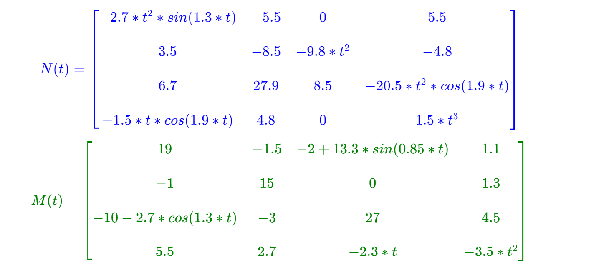

<!--     範例 App_49 儲存庫      -->

<!--   
# \[{  \color{Fuchsia}精\;銳\; \color{Purple}矩\;陣\;  \color{Red}計\;算\; \color{Green} 求\;解\;器  }\] 
-->  


<!--         
#### \[{  \color{Fuchsia} 【 \color{Green}  Sharp \; Matrix \; Solver \;  \color{Brown} \iff  \;  \color{Red} S\;M\;S】 }\]  
-->  
  

---

<!--    
## \[{ \color{Fuchsia} Time-Frequency-Signal \;(Response) \quad Solution  }\] 
-->
  

<!--   #### \[{  \color{Lavender} using }\]  -->  
  

<!--   
## \[  \color{Red} Precisely \; Numerical \; Value \; Computations  \]  
-->  
 

<!--   #### \[{ \color{Lavender}  with }\]  -->  


<!--   
## \[{ \color{Green} Real \; \color{Red} And \; \color{magenta} Complex \quad \; \color{Brown} Matrix \;\; Transform  }\] 
-->
  

---
<!--     
# \[{\color{Brown}時\quad頻\quad\color{Cyan}數\quad值\quad\color{Brown}計\quad算}\]

#### \[{ \color{Purple}Precisely \quad \color{Fuchsia}Time-Frequency \quad \color{Purple}Numerical \quad Computations}\]
-->


---
<!--      
# \[{\color{Tan}三\quad階\quad微\quad分\quad方\quad程\quad式 ：}\]  

### \[{\color{Coral}N(t) \ast \dot{\ddot{y}}(t) + M(t) \ast \ddot{y}(t) + C(t) \ast \dot{y}(t) + K(t) \ast y(t) = f(t)}\]

### \[{\color{Turquoise}由齊次解得到 \quad \dot{\ddot{y}}_h(t)、\ddot{y}_h(t)、\dot{y}_h(t)、y_h(t)}\]

### \[{\color{Red}由特別解得到 \quad \dot{\ddot{y}}_p(t)、\ddot{y}_p(t)、\dot{y}_p(t)、y_p(t)}\]
-->


<!--     
##### \[{\color{Green} \begin{bmatrix} \dot{\ddot{y}}_h(t) \\\\ \ddot{y}_h(t) \\\\ \dot{y}_h(t) \end{bmatrix} = \begin {bmatrix} -1.0 \ast N_i(t) \ast M(t) & -1.0 \ast N_i(t) \ast C(t) & -1.0 \ast N_i(t) \ast K(t) \\\\ I_d & Zero & Zero \\\\ Zero & I_d & Zero \end{bmatrix} \ast \begin{bmatrix} \ddot{y}_h(t)  \\\\ \dot{y}_h(t)  \\\\ y_h(t) \end{bmatrix} }\]  
-->


<!--   
## \[{ \color{Fuchsia} \begin{bmatrix} \dot{\ddot{y}}_h(t) \\\\ \ddot{y}_h(t) \\\\ \dot{y}_h(t) \end{bmatrix} = \color{Blue} A \ast \color{Brown} \begin{bmatrix} \ddot{y}_h(t) \\\\ \dot{y}_h(t) \\\\ y_h(t) \end{bmatrix} }\]   
-->  


<!--       
##### \[{\color{Olive}即 \quad A = \begin{bmatrix} -1.0 \ast N_i(t) \ast M(t) & -1.0 \ast N_i(t) \ast C(t) & -1.0 \ast N_i(t) \ast K(t) \\\\ I_d & Zero & Zero \\\\ Zero & I_d & Zero \end{bmatrix} }\]  

#### \[{ \qquad \qquad \color{Teal} A(t) \ast Q(t) = Q(t) \ast D(t) \quad \color{Orange} \Longrightarrow }\]  

## \[{ \color{Orange} A(t) = Q(t) \ast D(t) \ast Q_i(t)  }\]  
-->


<!--      
## \[{ \color{Red} \begin{bmatrix} \ddot{y}_h(t)  \\\\ \dot{y}_h(t) \\\\ y_h(t) \end{bmatrix} = H_{exp}(D, Q, t) \ast d }\]  
-->


<!--    
### \[{ \color{Brown} A是實數系統矩陣，D是複數對角線特徵值矩陣。}\]  

### \[{ \color{Brown} Q是複數特徵向量矩陣，Qi是Q的逆矩陣。}\]  

### \[{ \color{Brown} H_{exp}(D, Q, t) 為狀態與空間響應函數。}\]  

### \[{ \color{Green} \qquad \qquad 即SMS程式庫中的CxHexp(D, Q, t)類別 }\]  

### \[{ \color{Brown} d 為係數向量，由初始值或是邊界值而定。}\]  
-->


<!--     
# \[{ \color{Pink} 訊\quad號\quad響\quad應\quad值【振\quad幅】}\]  
-->


<!--    
## \[{ \color{Red} \begin{bmatrix} \ddot{y}(t) \\\\ \dot{y}(t) \\\\ y(t) \end{bmatrix} = \color{Blue} H_{exp}(D, Q, t) \ast d \color{Green} + \begin{bmatrix} \ddot{y}_p(t) \\\\ \dot{y}_p(t) \\\\  y_p(t) \end{bmatrix} }\]
-->  
  

---

<!--    
# \[{ \color{Tan}二\quad階\quad微\quad分\quad方\quad程\quad式 :}\]

### \[{ \color{Coral}M(t) \ast \ddot{y}(t) + C(t) \ast \dot{y}(t) + K(t) \ast y(t) = f(t) }\]

# \[{\color{Pink} 訊\quad號\quad響\quad應\quad值【振\quad幅】}\]
-->


<!--      
## \[{ \color{Red} \begin{bmatrix} \dot{y}(t) \\\\ y(t) \end{bmatrix} = \color{Blue} H_{exp}(D, Q, t) \ast d \color{Green} + \begin{bmatrix} \dot{y}_p(t) \\\\  y_p(t) \end{bmatrix} }\]
-->
  

---

<!--    
# \[{ \color{Tan}一\quad階\quad微\quad分\quad方\quad程\quad式：}\]

### \[{ \color{Coral}C(t) \ast \dot{y}(t) + K(t) \ast y(t) = f(t) }\]

# \[{ \color{Pink} 訊\quad號\quad響\quad應\quad值【振\quad幅】}\]
-->


---
<!--     
# \[{ \color{Tan}零\quad階\quad微\quad分\quad方\quad程\quad式：}\]

### \[{ \color{Coral}K \ast y = f }\]

# \[{ \color{Pink} 固\quad定\quad訊\quad號\quad響\quad應\quad值 }\]
-->


<!--      
#### \[{ \color{Red} \begin{bmatrix} y_0 \\\\ y_1 \\\\  \vdots \\\\ y_{m-2}  \\\\ y_{m-1} \end{bmatrix} = K_i \ast f }\]
-->  
  

---

> **r階微分方程式，其空間維度上有m個自由度，齊次微分方程式：N(t) * y'''(t) + M(t) * y''(t) + C(t) * y'(t) + K(t) * y(t) = f(t)，使用友矩陣(Companion Matrix)的方法，求得系統或狀態矩陣 A(t)，再求得 A(t) * Q(t) = Q(t) * D(t)，D（t）是特徵值矩陣，Q（t）是特徵向量矩陣，本求解法(Forward Problems)可對應於 Laplace、 Fourier、 Z Transform 或是捲積積分法(Inverse Problems)等等。隨時間變化的角頻率（w）是系統矩陣 A（t）之複數特徵值的虛數值，隨時間變化的模態，是系統矩陣 A（t）的特徵向量。D（t）和Q（t）為系統的潛在特性，並在系統受到外力時，才會顯現出來。若要求得系統的訊號響應值[Signal Response]，應由實際量測的初始值或是邊界值，求得複數係數向量d，再依據如下推導的公式求得。有關初始值和邊界值分別參見App_6J和App_6M儲存庫，而相關的推導公式和所顯示的數學矩陣方程式，如以上所示的矩陣表示式，其中D為複數特徵值矩陣，Q為複數特徵向量矩陣（模態），Q i為Q之逆矩陣，Hexp(D, Q, t)和d分別爲複數轉換矩陣和複數向量。**  

<!--    
# \[{ \color{Khaki}實 \quad 例 \quad 計 \quad 算 \quad :}\]  

### \[{ \color{Red} 啁啾(Chirp)系統的響應 }\]

### \[{ \color{Red} 詳細的C\#程式碼和輸出圖表 \color{Blue} \Longrightarrow }\]  

### \[{ \color{Red} \qquad 參考本儲存庫中的檔案  }\]
-->


---

<!--         
##### \[{ \color{Blue} N(t) = \begin{bmatrix} -2.7 \ast t^2 \ast sin(1.3 \ast t) & -5.5 & 0 & 5.5 \\\\ 3.5 & -8.5 & -9.8 \ast t^2 & -4.8 \\\\ 6.7 & 27.9 & 8.5 & -20.5 \ast t^2 \ast cos(1.9 \ast t) \\\\ -1.5 \ast t \ast cos(1.9 \ast t) & 4.8 & 0 & 1.5 \ast t^3 \end{bmatrix}  }\]  

##### \[{ \color{Green} M(t) = \begin{bmatrix} 19 & -1.5 & -2+13.3 \ast sin(0.85 \ast t) & 1.1 \\\\ -1 & 15 & 0 & 1.3 \\\\ -10-2.7 \ast cos(1.3 \ast t) & -3 & 27  & 4.5  \\\\ 5.5 & 2.7 & -2.3 \ast t & -3.5 \ast t^2 \end{bmatrix} }\]  
-->


<!--      
##### \[{ \color{Red} C(t) = \begin{bmatrix} 35 & -1-13.2 \ast sin(0.35 \ast t) & -0.5 & 2.5 \\\\ -1.5 & 40 & -1.5 & 0 \\\\ -1.2+22.5 \ast cos(1.95 \ast t) & -1.5 & 75 & 0 \\\\ -27.5 & 18.3 & 9.5 & -50.9 \ast t \ast sin(2.5 \ast t) \end{bmatrix} }\]  

##### \[{ \color{Brown} K(t) = \begin{bmatrix} 60 & -8 & -2-332 \ast sin(1.37 \ast t) & -2.7 \\\\ -16 & 180 & -120 & 100 \\\\ -20 & -100+579 \ast cos(0.24 \ast t) & 300 & 20 \\\\ 1.5 \ast sin(t) & -9.8 & 150 & 11.5 \ast t^2 \ast cos(t) \end{bmatrix} }\]  
-->


---

<!--      
## \[{ \color{Fuchsia} 啁啾(Chirp)\color{Green} \quad 系統矩陣A(t) }\]  

#### \[{ \color{Chocolate} A(t) = \begin{bmatrix} -1.0 \ast N_i(t) \ast M(t) & -1.0 \ast N_i(t) \ast C(t) & -1.0 \ast N_i \ast K(t) \\\\ I_d & Zero & Zero \\\\ Zero & I_d & Zero \end{bmatrix} }\]  

#### \[{ \color{Gold} A(t) \times Q(t) = Q(t) \times D(t) \quad \color{Blue} \Longrightarrow }\]  
-->


<!--      
## \[{ \color{Brown} \qquad \qquad A(t) = Q(t) \times D(t) \times Q_i(t) }\]  
-->


---

<!--      
## \[{ \color{Fuchsia} 啁啾(Chirp)\color{Green} \quad 系統響應 }\]

## \[{ \color{Green} 參見本儲存庫 \quad \color{Fuchsia} C\#程式碼  }\]  

##### \[{ \color{Blue} \begin{bmatrix} \dot{\ddot{y}}_h(t) \\\\ \ddot{y}_h(t) \\\\ \dot{y}_h(t) \end{bmatrix} = A(t) \ast \color{Red} \begin{bmatrix} \ddot{y}_h(t) \\\\ \dot{y}_h(t) \\\\ y_h(t) \end{bmatrix} \quad \color{Purple} \Longrightarrow }\]  
-->


<!--        
#### \[{ \color{Red} \begin{bmatrix} \ddot{y}_h(t) \\\\  \dot{y}_h(t) \\\\ y_h(t) \end{bmatrix} = Hexp(D, Q, t) \ast d  }\]  

#### \[{ \color{Purple} \begin{bmatrix} \ddot{y}_g(t) \\\\ \dot{y}_g(t) \\\\ y_g(t) \end{bmatrix} = \color{Red} \begin{bmatrix} \ddot{y}_h(t) \\\\  \dot{y}_h(t) \\\\ y_h(t) \end{bmatrix} + \color{Green} \begin{bmatrix} \ddot{y}_p(t) \\\\  \dot{y}_p(t) \\\\ y_p(t) \end{bmatrix} }\]  
-->


---

### 啁啾信號計算


```C#
// *** 時頻數值計算(Time-Frequency Numerical Computations) ***  

// 三階微分方程式: N(t)*y'''(t)+M(t)*y''(t)+C(t)*y'(t)+K(t)*y(t)= f(t) 
// 由齊次多空間和狀態維度之微分方程式，求得系統矩陣A，進而求
// 得A = Q * D * Qi。其中 D，Q，Qi 分別為特徵值、特徵向量、逆特徵
// 向量矩陣，進而求得訊號響應值 [y''|y'|y] = Hexp(D, Q, t) * d + 
// [y''|y'|y]p , 稱 Hexp(D, Q, t)為狀態和空間響應函數，d是由初始值或是
// 邊界值而定的係數向量，兩者均為複數矩陣和複數向量。    
// 本求解法可對應於Laplace、Fourier、Z Transform或是捲積積分法等等，
// 以上都是間接方法，而本法則是直接求取系統響應值。

using Matrix_0;

// 空間維度有m個自由度。
int m = 4;
// 狀態維度有r個自由度，即微分方程式r階(Order)。
int r = 3;

// 建構初始(空)矩陣 N, M、C、K、Zero、Id。
ReMatrix N = (new Zero(m)).GetMatrix;
ReMatrix M = (new Zero(m)).GetMatrix;
ReMatrix C = (new Zero(m)).GetMatrix;
ReMatrix K = (new Zero(m)).GetMatrix;
ReMatrix Zero = (new Zero(m)).GetMatrix;
ReMatrix Id = (new Iden(m)).GetMatrix;

// 實數系統矩陣A，複數特徵值矩陣D、複數特徵向量矩陣Q。
ReMatrix A;     CxMatrix D;    CxMatrix Q; 

// 狀態響應。速度，變位，加速度。(Step = 0.001秒，共計 t = 0.05秒) 
double step = 0.001;
int iRow = (int)(0.05 / step + 1);

// 建構時間軸上的儲存矩陣，增加時間t壹行，故儲存矩陣有m * r + 1行。
int iColD = m * r + 1;
CxMatrix CxVal = new CxMatrix(iRow, iColD);
ReMatrix ReVal = new ReMatrix(iRow, iColD);

for (int i = 0; i != iRow; i++)
{
    double t = step * i;

    // 建構 N、M、C、K 變數矩陣。
    N.Matrix[0, 0] = -2.7 * t * t * Math.Sin(1.3 * t);
    N.Matrix[0, 1] = -5.5;
    N.Matrix[0, 2] = 0;
    N.Matrix[0, 3] = 5.5;
    N.Matrix[1, 0] = 3.5;
    N.Matrix[1, 1] = -8.5;
    N.Matrix[1, 2] = -9.8 * t * t;
    N.Matrix[1, 3] = -4.8;
    N.Matrix[2, 0] = 6.7;
    N.Matrix[2, 1] = 27.9;
    N.Matrix[2, 2] = 8.5;
    N.Matrix[2, 3] = -20.5 * t * t * Math.Cos(1.9 * t);
    N.Matrix[3, 0] = -1.5 * t * Math.Cos(1.9 * t);
    N.Matrix[3, 1] = 4.8;
    N.Matrix[3, 2] = 0;
    N.Matrix[3, 3] = 1.5 * t * t * t;
    //  End of N  

    M.Matrix[0, 0] = 19;
    M.Matrix[0, 1] = -1.5;
    M.Matrix[0, 2] = -2 + 13.3 * Math.Sin(0.85 * t);
    M.Matrix[0, 3] = 1.1;
    M.Matrix[1, 0] = -1;
    M.Matrix[1, 1] = 15;
    M.Matrix[1, 2] = 0;
    M.Matrix[1, 3] = 1.3;
    M.Matrix[2, 0] = -10 - 2.7 * Math.Cos(1.3 * t);
    M.Matrix[2, 1] = -3;
    M.Matrix[2, 2] = 27;
    M.Matrix[2, 3] = 4.5;
    M.Matrix[3, 0] = 5.5;
    M.Matrix[3, 1] = 2.7;
    M.Matrix[3, 2] = -2.3 * t;
    M.Matrix[3, 3] = -3.5 * t * t;
    // End of M 

    C.Matrix[0, 0] = 35;
    C.Matrix[0, 1] = -1 - 13.2 * Math.Sin(0.35 * t);
    C.Matrix[0, 2] = -0.5;
    C.Matrix[0, 3] = 2.5;
    C.Matrix[1, 0] = -1.5;
    C.Matrix[1, 1] = 40;
    C.Matrix[1, 2] = -1.5;
    C.Matrix[1, 3] = 0;
    C.Matrix[2, 0] = -1.2 + 22.5 * Math.Cos(1.95 * t);
    C.Matrix[2, 1] = -1.5;
    C.Matrix[2, 2] = 75;
    C.Matrix[2, 3] = 0;
    C.Matrix[3, 0] = -27.5;
    C.Matrix[3, 1] = 18.3;
    C.Matrix[3, 2] = 9.5;
    C.Matrix[3, 3] = -50.9 * t * Math.Sin(2.5 * t);
    // End of C 

    K.Matrix[0, 0] = 60;
    K.Matrix[0, 1] = -8;
    K.Matrix[0, 2] = -2 - 332 * Math.Sin(1.37 * t);
    K.Matrix[0, 3] = -2.7;
    K.Matrix[1, 0] = -16;
    K.Matrix[1, 1] = 180;
    K.Matrix[1, 2] = -120;
    K.Matrix[1, 3] = 100;
    K.Matrix[2, 0] = -20;
    K.Matrix[2, 1] = -100 + 579 * Math.Cos(0.24 * t);
    K.Matrix[2, 2] = 300;
    K.Matrix[2, 3] = 20;
    K.Matrix[3, 0] = 1.5 * Math.Sin(t);
    K.Matrix[3, 1] = -9.8;
    K.Matrix[3, 2] = 150;
    K.Matrix[3, 3] = 11.5 * t * t * Math.Cos(t);
    // End of K 

    // 隨時間變化的系統矩陣A，(12X12矩陣)(m = 4, r = 3)。   
    ReMatrix Ni = ~N;
    A = (-1.0 * Ni * M) & (-1.0 * Ni * C) & (-1.0 * Ni * K);
    A = A | (Id & Zero & Zero) | (Zero & Id & Zero);

    Console.WriteLine(" i = {0}   t = {1}  ", i, t);
    Console.WriteLine("計算特徵值和特徵向量矩陣之前 : ");
    // 隨時間變化的系統特徵值矩陣 D ，特徵向量 Q 。 
    D = (new EIG(A)).CxMatrixD;
    Q = (new EIG(A)).CxMatrixQ;
    Console.WriteLine("   *** 計算特徵值和特徵向量之後 : **");

    // 將時間轉爲複數值。
    CxScalar cxScalar = new CxScalar(t, 0);
    // 隨時間變化的特徵值矩陣。
    CxVal[i, 0] = new CxMatrix(cxScalar);
    CxVal[i, 1] = D[0, 0];
    CxVal[i, 2] = D[1, 1];
    CxVal[i, 3] = D[2, 2];
    CxVal[i, 4] = D[3, 3];
    CxVal[i, 5] = D[4, 4];
    CxVal[i, 6] = D[5, 5];
    CxVal[i, 7] = D[6, 6];
    CxVal[i, 8] = D[7, 7];
    CxVal[i, 9] = D[8, 8];
    CxVal[i, 10] = D[9, 9];
    CxVal[i, 11] = D[10, 10];
    CxVal[i, 12] = D[11, 11];

    // 隨時間變化的角頻率(實數值轉爲矩陣)。       
    double[,] tMatrix = { { t } };

    ReVal[i, 0] = (ReMatrix)tMatrix;
    ReVal[i, 1] = D[0, 0].Im;
    ReVal[i, 2] = D[1, 1].Im;
    ReVal[i, 3] = D[2, 2].Im;
    ReVal[i, 4] = D[3, 3].Im;
    ReVal[i, 5] = D[4, 4].Im;
    ReVal[i, 6] = D[5, 5].Im;
    ReVal[i, 7] = D[6, 6].Im;
    ReVal[i, 8] = D[7, 7].Im;
    ReVal[i, 9] = D[8, 8].Im;
    ReVal[i, 10] = D[9, 9].Im;
    ReVal[i, 11] = D[10, 10].Im;
    ReVal[i, 12] = D[11, 11].Im;

}

Console.WriteLine("\n***  時間和特徵值(有十二組)，合計十三組複數值  ***");
Console.WriteLine("\n{0}\n\n", new PR(CxVal));

Console.WriteLine("\n***  特徵值矩陣的虛數值即角頻率  ***");
Console.WriteLine("       時間 t      ....   十二個角頻率 ");
Console.WriteLine("\n{0}\n", new PR(ReVal));

// 轉爲序列方式，以便使用python程式繪圖。 
Console.WriteLine("\n時間序列:   t\n{0}\n", new PR4(ReVal, 0));
Console.WriteLine("\n角頻率序列:w0\n{0}\n", new PR4(ReVal, 1));
Console.WriteLine("\n角頻率序列:w1\n{0}\n", new PR4(ReVal, 2));
Console.WriteLine("\n角頻率序列:w2\n{0}\n", new PR4(ReVal, 3));
Console.WriteLine("\n角頻率序列:w3\n{0}\n", new PR4(ReVal, 4));
Console.WriteLine("\n角頻率序列:w4\n{0}\n", new PR4(ReVal, 5));
Console.WriteLine("\n角頻率序列:w5\n{0}\n", new PR4(ReVal, 6));
Console.WriteLine("\n角頻率序列:w6\n{0}\n", new PR4(ReVal, 7));
Console.WriteLine("\n角頻率序列:w7\n{0}\n", new PR4(ReVal, 8));
Console.WriteLine("\n角頻率序列:w8\n{0}\n", new PR4(ReVal, 9));
Console.WriteLine("\n角頻率序列:w9\n{0}\n", new PR4(ReVal, 10));
Console.WriteLine("\n角頻率序列:w10\n{0}\n", new PR4(ReVal, 11));
Console.WriteLine("\n角頻率序列:w11\n{0}\n", new PR4(ReVal, 12));

/*輸出結果:

***  時間和特徵值(有十二組)，合計十三組複數值  ***

 0.00000 +  0.00000i, -11.77658 +   0.00000i,  -3.74980 +   0.00000i,
-2.20404 +  2.54725i,  -2.20404 -   2.54725i,   2.97024 +   0.49164i,
 2.97024 -  0.49164i,   1.50230 +   2.28138i,   1.50230 -   2.28138i,
-0.03875 +  2.53751i,  -0.03875 -   2.53751i,  -1.03565 +   1.15840i, 
    .
    .
    .
*/
```

# 本人初淺的見解如下

### **時頻數值計算，因爲每一段時間（可能是一秒或是千分之一秒或是百萬之一秒），系統都在變動，也就是相對的頻率都在變動。**

### **實際時頻數值計算，必須使用程式碼，才有可能計算出來，使用手算幾乎不可能。**  

### **時頻分析（Time-Frequency Analysis）包含各種轉換（Transform）等，是方法的闡釋，但最後、最後的目標，應該是實際精確的數值計算結果。故分析僅是過程中的手段，【正確的數值計算結果】才是目的。**

###  **動態系統的數值計算，輸入的數據應是實數值，輸出的結果也應該是實數值，要得到【精確的數值】，中間的運算過程，可能必須使用複數矩陣的計算，此部分也是使人產生困惑的地方，故稱【從古至今，複數矩陣的數學分析理論，似乎無法處理此逆問題【Inverse Problem】，故大膽假設此類的逆問題，僅為紙上談兵而以，唯有考慮為順問題【Forward Problem】，並使用程式碼，作實際的數值計算來解決】，即求解數學系統模型（Mathematical System Model）為主。**  

---

  
